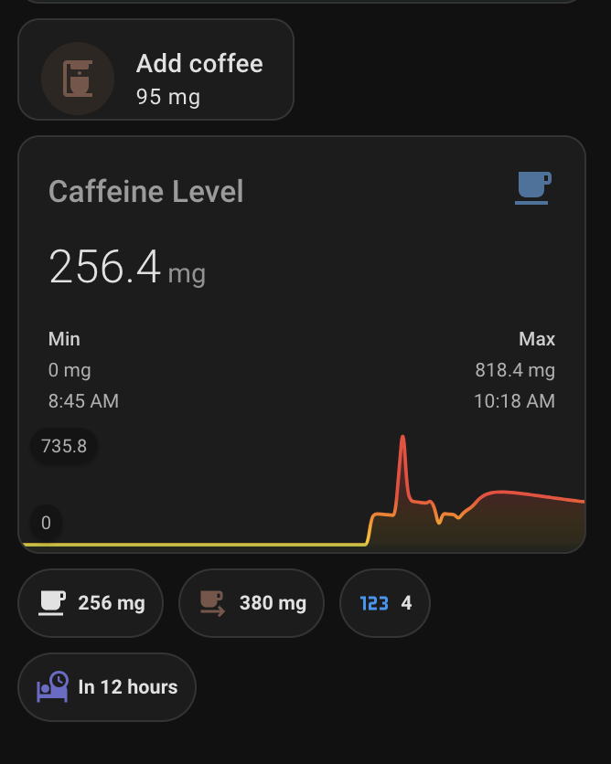

# Caffeine Tracker for Home Assistant

[](https://github.com/evanraalte/hacs-caffeinetracker/releases)
[](LICENSE)
[](https://github.com/hacs/integration)

A Home Assistant integration that tracks your caffeine levels using a science-based exponential decay model. It calculates current mg in your body, total daily intake, and estimates when it's safe to sleep.



## Features

- **Exponential Decay Model**: Sums all intake events and applies a per-person half-life (e.g., 5 hours).
- **Optional Absorption Delay**: Model gradual caffeine uptake (peak ~45 min after intake) instead of instant spikes.
- **Sleep-Safe Prediction**: Calculates the exact timestamp when your caffeine level will drop below your chosen threshold (e.g., 50mg).
- **Multiple Profiles**: Create separate trackers for different household members.
- **Service-Based Logging**: Easy to integrate with NFC tags, voice assistants (Siri/Alexa/Google), or custom dashboard buttons.
- **Persistent Storage**: Data is saved to `storage/` and survives Home Assistant restarts.

## Installation

### Method 1: HACS (Recommended)

1. Open **HACS** in Home Assistant.
2. Click the three dots in the top right and select **Custom repositories**.
3. Add `https://github.com/evanraalte/hacs-caffeinetracker` as an **Integration**.
4. Click **Install**.
5. Restart Home Assistant.

### Method 2: Manual

1. Download the latest release.
2. Copy the `custom_components/caffeine_tracker` folder to your HA `config/custom_components/` directory.
3. Restart Home Assistant.

## Setup

1. Go to **Settings -> Devices & Services**.
2. Click **+ Add Integration** and search for **Caffeine Tracker**.
3. Enter your name and caffeine metabolism settings:
   - **Half-life**: Time (hours) for caffeine to halve. Default is 5h (typical range 3–7h).
   - **Sleep-safe threshold**: mg level below which you can sleep well. Default is 50mg.
   - **Absorption Model**: If enabled, caffeine enters the bloodstream over ~45 minutes instead of instantly.

## Sensors

Each person profile creates the following sensors:

| Sensor | Description |
|--------|-------------|
| `Caffeine Level` | Current estimated mg in your body. |
| `Caffeine Consumed Today` | Total mg logged since local midnight. |
| `Consumptions Today` | Number of intake events logged since local midnight. |
| `Sleep Safe At` | Timestamp when you'll cross your sleep threshold. |
| `Estimated Peak Level` | (Only if absorption enabled) The highest level you'll reach from currently absorbed caffeine. |

## Service: Log Consumption

Target the **Device** (person profile) or the **Caffeine Level** sensor to log intake.

```yaml
action: caffeine_tracker.log_consumption
target:
  device_id: YOUR_DEVICE_ID  # Targeting the device logs to the profile exactly once
data:
  mg: 80
  label: Espresso
```

| Field | Description | Default |
|-------|-------------|---------|
| `mg` | Amount of caffeine in mg. | (Required) |
| `label` | Optional name (e.g., "Cold Brew"). | "custom" |
| `timestamp` | Optional ISO 8601 time for past logging. | "now" |

Other services:
- `caffeine_tracker.remove_last_consumption`: Undo the most recent entry.
- `caffeine_tracker.remove_consumption`: Remove a specific event by its ID (found in sensor attributes).
- `caffeine_tracker.clear_today`: Wipe all events logged today.

## Dashboard Examples

Check the [Lovelace Guide](docs/lovelace.md) for mini-graph and Mushroom card examples.

## Development

This project uses `uv` for dependency management and `Taskfile` for automation.

```bash
git clone https://github.com/evanraalte/hacs-caffeinetracker
cd hacs-caffeinetracker
task install
task test
```

### Commit conventions

This project uses [Conventional Commits](https://www.conventionalcommits.org/). Commit messages drive the changelog and version bumps via [git-cliff](https://git-cliff.org/).

| Prefix | When to use | Changelog section |
|--------|-------------|-------------------|
| `feat:` | New user-facing feature | Features |
| `fix:` | Bug fix | Bug Fixes |
| `docs:` | Documentation only | Documentation |
| `perf:` | Performance improvement | Performance |
| `refactor:` | Code change with no behaviour change | Refactoring |
| `test:` | Adding or fixing tests | Testing |
| `chore(deps):` | Dependency updates | Dependencies |
| `chore:` | Everything else (skipped in changelog) | — |
| `ci:` | CI/CD changes (skipped in changelog) | — |

Add `!` after the prefix (e.g. `feat!:`) or a `BREAKING CHANGE:` footer for breaking changes.

To cut a release: `task release VERSION=x.y.z`

## License

MIT - See [LICENSE](LICENSE) for details.
